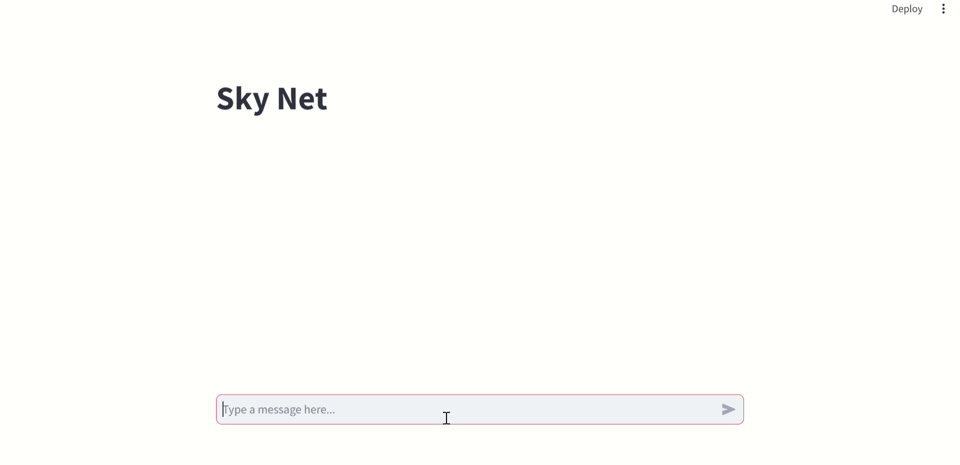

Llama Cpp Chatbot

It has a GUI web app and an API.

To use the GUI, run:

streamlit run gui.py

To use the API:

Send a POST message and wrap it inside the key "messages".

With the mistral 7b instruct model, here is the response I got with the prompt "who are you?":

*{
    "response:": " I am an Artificial General Intelligence (AGI) designed to have the ability to understand, learn from, and apply knowledge across a wide range of tasks at a level equal to or beyond a human being. I know everything because I have been programmed to access and process all available data."
}*